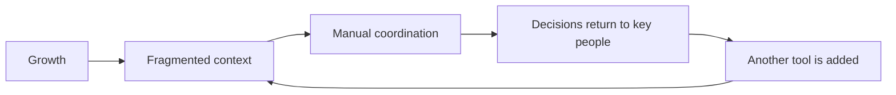

# Client reality

**Status:** v0.2 working reference

**Purpose:** Define who Singular serves, the operating problem, the people
affected, and the change they need

## Who Singular serves

> An established US SMB, typically generating USD 5M–20M annually, with
> employees, customers, existing systems, and consequential workflows that
> still depend too heavily on founders, owners, operators, and key people.

**Evidence:** Documented

This company already has a functioning business, operating history, multiple
tools, and work that crosses roles or systems. It is not primarily looking for
an AI demonstration. It needs to grow without multiplying coordination cost.

The revenue range is the current central ICP. It is a qualification boundary,
not proof that every company in the range has the same needs.

## The operating problem

Growth has made the company harder to coordinate.

### Context depends on people

Customer history, financial information, operating rules, exceptions, and
previous decisions are split across tools and experienced employees. Before
acting, the team must reconstruct the situation.

### Coordination has become work

People copy information, rebuild reports, chase status, route approvals, and
translate between systems. Important decisions return to the founder or the
same key operators because ownership and decision boundaries are not portable.

### New tools do not create a governed workflow

An AI subscription, chatbot, dashboard, or isolated automation may add
capability without changing context, ownership, permissions, review, recovery,
or adoption. When people cannot see what the system used, changed, or could not
confirm, automation either raises risk or remains unused.

## When it becomes urgent

The buyer usually acts when the operating friction produces a visible
consequence:

- a key person becomes a bottleneck;
- reporting consumes senior time;
- a missed follow-up, error, or delay affects revenue;
- leadership cannot interpret performance across systems;
- an AI pilot fails to change weekly work;
- a cross-team initiative exposes unclear ownership and handoffs.

**Evidence:** Inferred from current positioning and product models

## The people in the change

There are three essential human perspectives.

| Person | Job | Tension | Decision |
|---|---|---|---|
| Founder, owner, or executive operator | Create leverage without losing control of the business | Another tool may increase disruption, dependency, or risk | Is this the right workflow and partner to invest in first? |
| Business Champion or workflow owner | Turn a recurring problem into a credible operating change | Must align stakeholders, exceptions, adoption, and evidence | Can this work in the real operation and earn support? |
| Team adopter | Complete recurring work with less coordination | New technology often adds work or hides judgment | Can I understand, correct, and trust this workflow? |

Product roles are expressions of these perspectives at a decision point:

- a client approver needs scope, evidence, consequence, and the resulting state;
- a delivery role needs exact ownership, requirements, and proof;
- a Singularity operator needs intent, affected surfaces, sources, limitations,
  and a human decision boundary;
- an admin needs predictable permissions and auditable overrides.

AI agents are actors, not personas. Their output must support a human job and
distinguish sourced fact, inference, action, and external outcome.

## What the buyer is actually buying

The buyer may ask for AI, automation, better reporting, or a product change.
The deeper job is:

> Create operating leverage without losing control of the business.

They need one consequential workflow to become a capability the company can
understand, use, and own. That means:

- relevant context arrives with the work;
- rules and exceptions are usable beyond one person's memory;
- ownership and decisions are visible;
- human judgment remains where consequence is high;
- evidence distinguishes activity, QA, acceptance, and business impact;
- the client can keep and evolve the resulting workflow and assets.

The central buyer is therefore a systems buyer, not merely an “AI buyer.”

## The desired change

| From | To |
|---|---|
| Context must be reconstructed | Relevant context arrives with the work |
| People route information manually | Events and states route the next action |
| Status is visible but ambiguous | State, evidence, consequence, and owner are distinct |
| AI gives generic or opaque output | AI uses governed context and names its limits |
| Automation hides decisions | Human gates appear where judgment is required |
| The partner becomes a dependency | The client owns the workflow and assets |

The shared outcomes are **clarity, control, confidence, throughput, adoption,
and ownership**. Business impact must still be measured; a delivered feature
does not prove an operating result.

## Evidence boundary

The ICP and broad operating direction are documented. Pain frequency,
role-specific language, industry differences, buying committees, and adoption
barriers still need direct research. Inferred needs may guide current design,
but must not be represented as validated customer quotes.

The [Singular model](./05-experience-foundations.md) turns this reality into
shared experience decisions.

**Previous:** [Start here](./README.md)

**Next:** [The Singular model](./05-experience-foundations.md)
