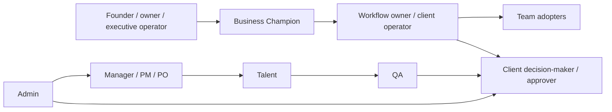

# Users, jobs, and pain points

**Status:** v0.1 working reference

**Purpose:** Define the human system Singular communicates with and designs for

**Scope:** Marketing audiences, client product users, and internal delivery
users

The “Singular user” is not one persona. Singular serves a company through a
chain of people who recognize the problem, sponsor change, operate the workflow,
adopt the result, and make decisions inside Singular products.

## Audience is not the same as product role

- A **marketing audience** is deciding whether the problem and Singular's
  approach are relevant.
- A **product user** is trying to understand or change a state inside a
  workflow.
- A **delivery role** is responsible for moving, verifying, or administering
  work.

One person may move through all three. The writing and interface must respond
to the job they are doing now.

## Human system at a glance

This is a relationship map, not a reporting structure.

## Marketing audiences

### Founder, owner, or executive operator

**Evidence:** Documented

**Context**

Leads an established SMB and remains accountable for operating performance.
The company has grown, but important context and decisions still return to a
small number of people.

**Job to be done**

Create leverage and a more reliable operating model without losing control of
the business.

**Pain points**

- decisions repeatedly escalate back to them;
- reporting and follow-up consume senior capacity;
- performance is hard to see across systems;
- process gaps appear as the company grows;
- AI experiments are disconnected from operating outcomes;
- another failed implementation would cost money and credibility.

**Emotional tension**

- “If I delegate this, will quality or control decline?”
- “Will this create another system the team has to feed?”
- “Can I trust the result without checking every step?”
- “Will the company own what gets built?”

**Decision**

Is this the right operating problem and partner to invest in first?

**Needs to know**

- the recognizable business consequence;
- the proposed operating change;
- why this is not another generic AI pilot;
- what remains under human control;
- who owns the result;
- what is evidence versus promise;
- the next commitment.

### Business Champion

**Evidence:** Inferred

**Context**

An operations or functional leader who sees the failure, can assemble context,
and can coordinate a first initiative, but may not own the final budget.

**Job to be done**

Turn a recurring operating problem into a credible initiative that leadership
and the team can support.

**Pain points**

- incomplete authority across the whole workflow;
- pressure to show value early;
- multiple stakeholders interpret the problem differently;
- limited implementation capacity;
- previous tools or pilots did not become operating behavior;
- the recommendation must be defendable internally.

**Emotional tension**

- “Can I sponsor this without creating another failed project?”
- “Will leadership see a concrete outcome?”
- “Will the team understand why the workflow must change?”

**Decision**

Can I champion this initiative with confidence?

**Needs to know**

- initial scope and business consequence;
- owner and decision path;
- evidence and adoption standard;
- implementation boundary;
- what happens after the first capability.

### Workflow owner or client operator

**Evidence:** Inferred / supported by product structure

**Context**

Understands the daily workflow, exceptions, systems, and people affected by the
change. May also act as Product Owner.

**Job to be done**

Make the workflow run reliably, with clear ownership and fewer manual handoffs.

**Pain points**

- context arrives late or incomplete;
- people work around the official process;
- exceptions depend on private knowledge;
- approvals and follow-ups are difficult to trace;
- current reports show activity without explaining what requires action;
- changes create hidden work for the team.

**Emotional tension**

- “Does this reflect how the work actually happens?”
- “Who handles the exceptions?”
- “Will I still be able to correct or stop the system?”

**Decision**

Can this capability operate in real work, not only in a demo?

**Needs to know**

- current and proposed workflow;
- inputs, outputs, owner, and exceptions;
- permission and review model;
- evidence and success measure;
- recovery and escalation path.

### Team adopter

**Evidence:** Inferred

**Context**

Performs or depends on the workflow. May not choose Singular, but determines
whether the resulting system becomes useful operating behavior.

**Job to be done**

Complete recurring work with less coordination and clearer context without
losing judgment or agency.

**Pain points**

- copying information between tools;
- chasing status or approval;
- reconstructing context before acting;
- repeating reports and follow-ups;
- correcting inconsistent data;
- adopting tools that do not match the work.

**Emotional tension**

- “Will this add work before it removes work?”
- “Is automation hiding a decision I am responsible for?”
- “What happens when the system is wrong?”

**Decision**

Can I trust and adopt this workflow in daily work?

**Needs to know**

- what changes in the day-to-day workflow;
- what stays under human control;
- how to review, correct, or escalate;
- what the system can and cannot do;
- who owns the workflow after implementation.

## External product users

### Client decision-maker

**Evidence:** Documented in Singular Stories

Uses Singular Stories to connect strategy, proposed scope, delivery, QA
evidence, and commercial consequence. Authorizes work before execution and
accepts or returns delivery after QA.

**Primary job**

Make an informed commitment without reconstructing the full project history.

**Primary pain**

- scope and outcome can become disconnected;
- approval language can hide the real consequence;
- evidence can be present without proving acceptance;
- status can be visible without clarifying the next decision.

**Information required**

- Project, Objective, Key Result, and Key Project context;
- selected Stories and Story Points;
- decision phase;
- evidence, risk, exclusions, and consequence;
- exact resulting state.

### Client operator or Product Owner

**Evidence:** Documented / inferred

Monitors delivery, dependencies, active work, QA, risk, and next decisions.

**Primary job**

Coordinate the client side of delivery with enough operational context to act.

**Primary pain**

- project information is distributed across work items and conversations;
- dependencies and decisions are easy to miss;
- team members may use different terminology for the same work;
- status alone does not explain impact.

### Mobile executive approver

**Evidence:** Documented in Singular Approvals

Uses the mobile experience for focused Pre-Work authorization and Post-Work
acceptance.

**Primary job**

Review and sign a consequential decision quickly without losing scope,
identity, or evidence.

**Primary pain**

- mobile space encourages oversimplification;
- “Approve all” can hide included Tasks;
- Pre-Work authorization and Post-Work acceptance can be confused;
- biometric confirmation can feel like proof without decision context.

**Information required**

- phase and Sprint;
- selected Tasks and total SP;
- Business Story first, Technical Story second;
- evidence or decision brief;
- what signing changes;
- identity, KYC, and authority state.

### Singularity operator

**Evidence:** Documented in Singularity Studio

A semi-technical SMB operator who describes product intent in natural language,
watches the system scope the work, and reviews preview, diff, and sources.

**Primary job**

Move from intent to a reviewable product change without needing to translate
the request into repository detail.

**Primary pain**

- cannot safely evaluate invisible agent work;
- may not understand implementation vocabulary;
- needs speed but cannot risk silent production changes;
- must know when human expertise is required;
- optimistic AI language can create false confidence.

**Information required**

- what the system understood;
- what surfaces and constraints it identified;
- what it changed or only proposed;
- which sources it used;
- what remains uncertain;
- whether the result is sandboxed, reviewable, blocked, or externally confirmed.

## Internal product users

### Manager, PM, or PO

**Evidence:** Documented in Singular Stories

Coordinates scope, delivery, staffing, QA, risk, and selected commercial
information.

**Job**

Keep strategy and delivery connected across Projects without taking client or
QA decisions out of their proper phase.

### Talent

**Evidence:** Documented in Singular Stories

Plans and delivers assigned Stories, provides delivery evidence, and responds
to QA or client feedback.

**Job**

Understand exactly what is expected, prove what was delivered, and recover from
Fixing or Stuck states.

### QA

**Evidence:** Documented in Singular Stories

Independently validates delivery, records findings and evidence, and routes
corrections.

**Job**

Separate delivery proof, QA judgment, and client acceptance.

### Admin

**Evidence:** Documented in Singular Stories

Operates cross-project queues, users, staffing, QA, payments, and overrides.

**Job**

Resolve operational exceptions while keeping permissions and state changes
auditable.

## AI agents are actors, not users by default

Agents may interpret intent, generate work, summarize evidence, or propose a
decision. They do not replace the human audience.

For every agent output, identify:

1. the human who receives it;
2. the decision or action it supports;
3. the sources available;
4. what is known, inferred, and unconfirmed;
5. the boundary between suggestion, execution, review, and external outcome.

## Cross-user pain themes

| Theme | Founder / buyer | Operator / adopter | Product user |
|---|---|---|---|
| Fragmented context | Cannot see the operation | Rebuilds context | Cannot interpret state quickly |
| Key-person dependency | Remains the bottleneck | Waits for private knowledge | Cannot proceed without another role |
| Manual coordination | Senior capacity is consumed | Chases updates and approvals | Repeats navigation and reporting |
| Unclear ownership | Decisions return upward | Exceptions have no owner | Next action or permission is ambiguous |
| Weak evidence | Cannot prove impact | Cannot trust output | State appears stronger than proof |
| Automation anxiety | Fears loss of control | Fears hidden decisions | Needs source, limitation, and recovery |
| Adoption risk | Another project may fail | New system may add work | Workflow does not match the real job |

## The user journey across Singular

| Stage | User question | Singular communication job |
|---|---|---|
| Recognition | “Why does growth still feel this manual?” | Name the operating problem without hype |
| Evaluation | “Is this different from another AI pilot?” | Explain the workflow, ownership, and proof boundary |
| Commitment | “What are we agreeing to first?” | Make scope, outcome, owner, and next step explicit |
| Delivery | “What is happening and who owns it?” | Connect strategy, work, evidence, and state |
| Decision | “What changes if I authorize or accept?” | Show scope, consequence, and resulting state |
| Adoption | “Can the team use and correct this?” | Make control, recovery, and exceptions visible |
| Scale | “What should we change next?” | Use evidence to choose the next capability |

## Validation backlog

The following require direct research:

- which role most often becomes the Business Champion;
- employee count and operating maturity by best-fit segment;
- pain frequency and severity in customers' own language;
- objections by buyer role and stage;
- adoption barriers for team members;
- whether clients understand Singular Stories, Singular Agile, Company Brain,
  River, and Totems without explanation;
- decision information clients actually use in approvals;
- perceived boundaries between automation and human judgment.

Until then, inferred needs guide v0.1 design but must not be presented as
validated customer quotes.

---

**Previous:** [Client context](./01-client-context.md)

**Next:** [Problem and outcome model](./03-problem-and-outcome-model.md)
