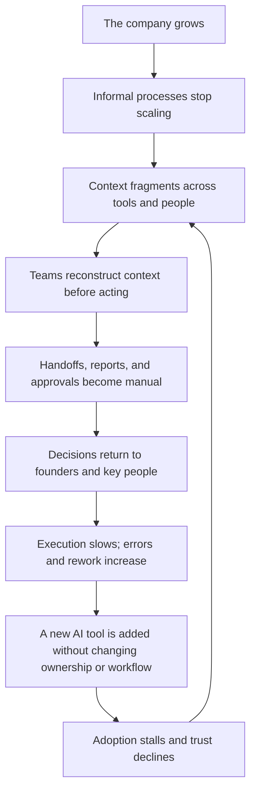

# Problem and outcome model

**Status:** v0.1 working reference

**Purpose:** Connect visible pain to root cause, human consequence, and desired
operating change

Singular's clients rarely experience one isolated problem. They experience a
system of reinforcing failures: growth increases complexity, context fragments,
coordination becomes manual, decisions remain concentrated, and new tools fail
to change the underlying workflow.

## The causal story



The loop explains why “buy another tool” is not a sufficient response.

## Surface symptoms vs. root problems

| What the client sees | Deeper operating problem |
|---|---|
| Reports take hours to assemble | Context and definitions are not connected |
| The owner approves too many routine decisions | Authority and operating rules are not portable |
| People copy data between systems | The workflow crosses tools without a shared operating layer |
| Teams ask AI the same question and get different answers | AI lacks governed company context and source boundaries |
| Status meetings keep multiplying | State, evidence, and ownership are not visible in the work |
| A pilot looks impressive but weekly work stays the same | Adoption, exceptions, and decision rights were not designed |
| Approvals happen in messages | Scope, consequence, identity, and history are not preserved together |

## The five core problem clusters

### 1. Operating dependency

**Visible pain**

- the founder or senior operator remains the default escalation path;
- one employee is the only person who understands a process;
- work stops when a key person is unavailable.

**Root cause**

Rules, context, and decision rights live in people rather than a shared
operating system.

**Business consequence**

Leadership capacity becomes the growth ceiling.

**Human consequence**

Leaders cannot step away; employees cannot act confidently.

**Desired change**

Relevant context and decision boundaries become usable by the right person or
agent without removing accountability.

### 2. Fragmented context

**Visible pain**

- different systems show different versions of the same situation;
- people search several tools before answering a question;
- historical decisions are hard to recover;
- AI responses are generic or inconsistent.

**Root cause**

Live operating signals, stable business rules, and decision history are not
connected.

**Business consequence**

Decisions are slower and based on incomplete interpretation.

**Human consequence**

People spend judgment on finding information instead of using it.

**Desired change**

The company can assemble decision-ready context with source trace and
permissions.

### 3. Manual coordination

**Visible pain**

- repeated data entry;
- status chasing;
- manual reporting;
- fragile handoffs;
- meeting notes that never become owned work;
- approvals that require follow-up.

**Root cause**

The workflow does not connect events, owners, states, and next actions.

**Business consequence**

Throughput drops while coordination cost rises.

**Human consequence**

Experienced employees become routers for information.

**Desired change**

The workflow moves context and work forward while preserving exceptions and
human decisions.

### 4. Activity without evidence

**Visible pain**

- dashboards show motion but not meaning;
- delivery is reported without proof;
- QA completion is confused with client acceptance;
- marketing claims appear without a source;
- AI says “done” before an external outcome exists.

**Root cause**

Fact, inference, action, evidence, and commitment are not separated.

**Business consequence**

Leaders cannot reliably evaluate progress or risk.

**Human consequence**

Users double-check the system or stop trusting it.

**Desired change**

Every important state has an owner, evidence boundary, and next decision.

### 5. Automation without control

**Visible pain**

- people cannot see what the system read or changed;
- high-consequence actions appear as generic confirmations;
- errors do not explain what was preserved;
- permissions and human review appear late;
- users do not know how to correct or stop a run.

**Root cause**

Automation is treated as execution only, without governance, recovery, or
adoption.

**Business consequence**

Risk increases or automation remains unused.

**Human consequence**

Speed feels like loss of control.

**Desired change**

Assisted and automated work remains inspectable, bounded, reversible when
possible, and explicitly human-gated when necessary.

## Functional, emotional, and organizational pains

| Layer | Pain | What Singular must address |
|---|---|---|
| Functional | Work is slow, repeated, or error-prone | Workflow, context, state, and automation |
| Emotional | The user fears losing control or sponsoring failure | Transparency, boundaries, recovery, and proof |
| Organizational | Ownership and definitions vary across teams | Shared language, decision rights, and governance |
| Strategic | Growth depends on more coordination and headcount | Repeatable operating capability and adoption |

A feature that addresses only the functional pain may still fail if the
emotional and organizational risks remain.

## From current state to desired operating state

| Current state | Desired state |
|---|---|
| Context must be reconstructed | Relevant context arrives with the work |
| Rules live in people's heads | Stable rules are documented and usable |
| Owners route information manually | Events and states route the next action |
| Status is visible but ambiguous | State, evidence, consequence, and owner are distinct |
| AI gives generic output | AI uses governed context and names its limits |
| Automation hides decisions | Human gates appear where consequence requires judgment |
| Progress is described as activity | Progress is connected to an operating outcome |
| The partner becomes another dependency | The client owns the resulting assets and workflow |

## The outcome hierarchy

Singular should not jump directly from a feature to a business promise.

```text
system or content change
→ workflow behavior changes
→ user can act with less coordination or ambiguity
→ operating performance changes
→ business outcome may become measurable
```

Example:

```text
Approval summary includes selected scope, evidence, and consequence
→ approver can evaluate the decision without reconstructing context
→ fewer clarification loops and safer authorization
→ shorter decision latency
→ delivery can begin with clearer commitment
```

The final business impact must be measured, not assumed.

## The shared desired outcomes

### Clarity

People can understand what is happening, why it matters, and what information
supports it.

### Control

People can see ownership, permissions, decision boundaries, and recovery paths.

### Confidence

The system is specific about sources, evidence, limitations, and consequences.

### Throughput

Less experienced time is spent on searching, translating, reporting, and
routing.

### Adoption

The capability fits real work, preserves necessary judgment, and becomes
repeatable behavior.

### Ownership

The client can keep and evolve the workflow, knowledge, and implementation
artifacts created for its operation.

## Communication implications

This model requires Singular to:

- lead with the operating future or recognizable pain, not the tool;
- explain the mechanism as a changed workflow;
- distinguish proof from promise;
- preserve context when the user must decide;
- state what the system knows and cannot confirm;
- make ownership and next action visible;
- avoid false simplicity, hype, and generic AI language.

These implications become the
[Experience foundations](./05-experience-foundations.md) and the
[UX Writing, Voice & Tone Manual](../ux-voice/README.md).

## Must-never-happen failures

- A generic AI story replaces the client's operating reality.
- A visual or verbal flourish hides state, scope, or evidence.
- Marketing urgency enters a product decision.
- A product claims an external outcome it cannot confirm.
- Automation removes a human gate without a clear risk decision.
- The system makes the client dependent on Singular for assets the client was
  promised to own.
- An inferred pain is presented as a customer quote or validated fact.

---

**Previous:** [Users, jobs, and pain points](./02-users-jobs-and-pain-points.md)

**Next:** [How Singular collaborates](./04-how-singular-collaborates.md)
