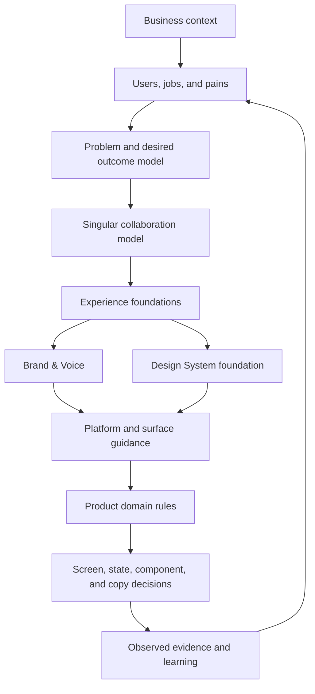

# From foundations to system

**Status:** v0.1 working reference

**Purpose:** Show how client reality becomes Brand & Voice, Design System
contracts, surface profiles, and domain decisions

The Singular system is not a library of visual assets with strategy added
later. It is a chain of decisions that begins with the client and becomes more
specific as it moves toward implementation.

## The complete derivation



The feedback loop matters. Product evidence can refine a user hypothesis, but a
local implementation does not automatically redefine the shared foundation.

## Two shared systems

### Brand & Voice

Brand & Voice governs how Singular creates meaning and recognition:

- who Singular is speaking to;
- the problem frame;
- positioning boundaries;
- character and tone;
- writing principles;
- terminology;
- narrative patterns;
- claims and evidence;
- visual identity intent and approved assets.

The human-readable visual reference is the
[Singular Brand Foundation](../brand/README.md). The canonical writing
reference is the [UX Writing, Voice & Tone Manual](../ux-voice/README.md).

### Design System

The Design System governs shared visual and interaction contracts:

- tokens and semantic roles;
- typography roles;
- spacing, radius, elevation, and motion;
- accessibility behavior;
- portable components;
- state communication;
- platform mappings;
- surface profiles;
- adoption and governance.

Brand & Voice and the Design System share the same experience foundations. One
does not sit “inside” the other. They meet in each surface.

## The Design System layers

| Layer | Owns | Example | Must not own |
|---|---|---|---|
| Business context | ICP, user problems, desired outcomes | Founder dependency, fragmented context | UI values or product status |
| Experience foundation | Stable cross-surface principles | Preserve context; evidence before assertion | Framework APIs |
| Brand & Voice | Meaning, identity, narrative, language | Calm authority; exact claims; blue/cyan identity | Product permissions |
| DS foundation | Shared semantic visual and interaction roles | Status tokens, type roles, spacing, focus | Customer-specific data |
| Platform | Native or technical mapping | CSS/Tailwind, SwiftUI, email, canvas | Product workflow composition |
| Surface | Recurring pattern for a channel/product type | Website narrative, Studio evidence workspace | Routes or customer records |
| Domain | Product entities and behavior | Story authorization, Task approval, agent run state | Shared brand foundations |
| Instance | The concrete experience | One approval modal or hero | New system rules by accident |

The implementation-facing four-layer model remains in
[`references/architecture.md`](../references/architecture.md). This document
adds the upstream strategic layers.

## How a foundation becomes a system decision

### Client need: distinguish truth from confidence

**Experience foundation**

Use evidence before assertion.

**Brand & Voice expression**

- claims require status and source;
- testimonials remain verbatim;
- Product copy distinguishes proposal, delivery, and external outcome.

**Design System expression**

- status is semantic, not a brand tint;
- source and evidence patterns are visible;
- success feedback cannot imply a stronger domain state.

**Surface expression**

- Studio separates Preview, Diff, and Sources;
- Stories separates delivery evidence, QA, and client acceptance;
- Marketing separates proof from promise.

### Client need: leverage without losing control

**Experience foundation**

Keep automation under meaningful human control.

**Brand & Voice expression**

- calm, non-defensive explanation;
- explicit limitation and consequence;
- no “magic” or autonomous certainty.

**Design System expression**

- decision controls are distinct from activity;
- warnings show scope and reversibility;
- blocked and needs-review states have semantic treatment;
- progress does not steal focus or imply completion.

**Surface expression**

- Studio routes high-risk work to experts;
- iOS shows selected Tasks before Face ID;
- Stories uses distinct authorization and acceptance states.

### Client need: understand complexity without losing context

**Experience foundation**

Make complexity navigable and preserve relevant context.

**Brand & Voice expression**

- structured narrative;
- exact terminology;
- one primary idea per block;
- context precedes mechanism or decision.

**Design System expression**

- clear hierarchy and progressive disclosure;
- dense product surfaces remain scannable;
- mobile reduces display density without removing decision context;
- reusable summary, source, and status patterns.

## Why the surfaces differ

One identity does not require one interface style.

| Surface | User job | Required character |
|---|---|---|
| Website | Recognize a problem and evaluate Singular | Narrative, editorial, dark-first, ambitious but grounded |
| Web app / Stories | Coordinate and inspect operating work | Dense, predictable, state- and data-oriented |
| Studio | Express intent and review agent work | Conversational plus evidence-rich, calm under activity |
| iOS | Review, triage, and approve | Native, concise, touch-safe, decision-first |
| Slides | Understand a case and make a decision | Executive, sequenced, one takeaway per slide |
| Social | Recognize one idea quickly | Immediate, singular focus, strong claim discipline |
| Email | Read and act in constrained clients | Robust, direct, intent-specific |

Forcing every surface to look or sound identical would weaken usability.
Shared foundations create coherence; surface profiles preserve the correct
behavior.

## How current Design System choices connect to the foundations

| System choice | Upstream reason |
|---|---|
| One stable blue/cyan identity | Creates recognition across a multi-surface system |
| Separate brand and interaction roles | Prevents identity color from carrying every action or state |
| Semantic status independent from brand | Makes operational meaning explicit and accessible |
| Poppins display + Inter body + mono for data | Separates narrative hierarchy, reading, and exact operational values |
| Restrained motion and reduced-motion support | Keeps activity understandable without creating pressure or spectacle |
| Dark-first marketing, light/dark product profiles | Preserves brand expression while supporting operational reading needs |
| Native SwiftUI behavior | Keeps mobile decisions predictable and accessible |
| Studio Preview/Diff/Sources | Makes agent output inspectable before commitment |
| Tokens before local values | Maintains shared meaning and reduces silent drift |
| Variants before new components | Preserves a coherent pattern language across products |

Some visual choices are brand conventions rather than direct consequences of
customer research. The table explains their system role without inventing a
causal research claim.

## What remains product-local

The shared system must not absorb:

- routes;
- data fetching;
- customer records;
- permission logic;
- Story or Task transitions;
- approval policy;
- agent orchestration;
- billing or payment rules;
- website offer details;
- client-specific copy;
- evidence that a claim is true.

Product repositories are canonical for their behavior. This repository is
canonical for shared foundations and portable contracts.

## Promotion rule

A local decision may become shared when:

1. its user job is understood;
2. its state model is explicit;
3. at least two surfaces need the same semantic contract, or the decision is a
   true foundation;
4. existing tokens, variants, and components cannot support it;
5. domain logic and product copy can be removed;
6. accessibility and responsive or native behavior are defined;
7. the trade-off and evidence are documented.

Reuse alone is not enough. A pattern must also preserve meaning.

## Source-of-truth map

| Decision | Source |
|---|---|
| Client definition | [`docs/01-client-context.md`](./01-client-context.md) |
| User jobs and pains | [`docs/02-users-jobs-and-pain-points.md`](./02-users-jobs-and-pain-points.md) |
| Experience principles | [`docs/05-experience-foundations.md`](./05-experience-foundations.md) |
| Brand character and visual principles | [`brand/README.md`](../brand/README.md) |
| Voice and tone | [`ux-voice/README.md`](../ux-voice/README.md) |
| Machine-readable DS files and bundles | [`design-system.json`](../design-system.json) |
| Technical DS layers | [`references/architecture.md`](../references/architecture.md) |
| Tokens | [`tokens/README.md`](../tokens/README.md) |
| Components | [`components/README.md`](../components/README.md) |
| Surface behavior | [Application map: surface routing](./08-application-map.md#surface-routing) |
| Domain behavior | The applicable product repository |
| Adoption and release | [`references/adoption-and-governance.md`](../references/adoption-and-governance.md) |

## The traceability requirement

For a material design, content, or system decision, record:

```text
client situation
→ user and job
→ pain or risk
→ foundation
→ decision
→ system layer
→ surface expression
→ evidence or validation need
```

The next document turns this sequence into a reusable decision framework.

---

**Previous:** [Experience foundations](./05-experience-foundations.md)

**Next:** [Decision framework](./07-decision-framework.md)
