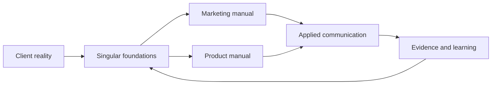

# Start here — This is why Singular sounds like Singular

**Status:** v0.5 working reference

**Audience:** Anyone working with Singular

**Language:** English (US)

**Owner:** Product Design

**Last reviewed:** July 30, 2026

You should not need to know our products, terminology, or history to understand
this system.

Start with the business. An established company is growing, but context is
spreading across people and tools. Senior operators rebuild information.
Decisions keep returning to the founder. Another AI product appears, but the
weekly work stays the same.

That is where Singular enters.

We take one consequential workflow and make its context, rules, owners,
decisions, and evidence work together. People keep meaningful control. The
client keeps ownership. What we learn from that reality becomes our
foundations, our personality, our Design System, and every sentence we write.

The result is one connected system with two manuals:

- **Marketing** helps the right person recognize the problem, understand our
  approach, trust the evidence, and choose a useful next step.
- **Product** helps someone understand what happened, make a decision, act, or
  recover without losing context or control.

They sound like the same Singular because they come from the same foundations.
They do different jobs because the reader is making a different decision.

## The five chapters

| Chapter | What it gives you |
|---|---|
| [Start here](./README.md) | The complete story in a few minutes |
| [Foundations](./05-experience-foundations.md) | The client, problem, Singular model, personality, and reason behind the system |
| [Marketing manual](../ux-voice/marketing.md) | Website, presentations, proposals, case studies, social, email, and public narrative |
| [Product manual](../ux-voice/product.md) | Singular Stories, Singular Approvals, Singularity Studio, states, actions, errors, evidence, and AI |
| [Apply & evolve](./08-application-map.md) | How to choose the right manual, trace a decision, and update the system responsibly |

If you only remember one thing, remember this:

> We do not begin with what Singular wants to say. We begin with what a person
> needs to understand, decide, or change.

**Next:** [Foundations](./05-experience-foundations.md)
