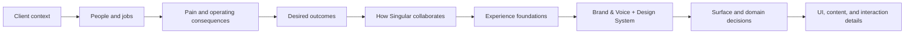

# Start here — The Singular system

**Status:** v0.1 working reference

**Audience:** Anyone working with Singular

**Language:** English (US)

**Owner:** Product Design

**Last reviewed:** July 29, 2026

This is the front door to Singular's business, brand, product, and Design
System documentation.

Do not start with colors, components, or copy rules. Start with the company
Singular serves, the people inside it, and the operating problem they are
trying to solve. The foundations and guidelines only make sense when their
origin is visible.

## The story in one paragraph

Singular serves established US SMBs—typically USD 5M–20M in annual
revenue—whose growth has made operating work harder to coordinate. Their
context is fragmented across tools and people; reporting, handoffs, and
approvals require manual effort; and AI experiments often add another layer
without changing weekly work. Singular collaborates with founders, owners,
operators, and their teams to turn one consequential workflow into a governed
operating capability. The client keeps ownership. Context, decisions, evidence,
and human control remain visible. Those needs create Singular's experience
foundations; the foundations shape Brand & Voice and the Design System; and
those systems guide every surface, state, component, and sentence.

## The story spine

Every shared Singular decision should be traceable through this chain. A
component or sentence that cannot be connected to a user need, a foundation,
or a system responsibility is not automatically a Singular decision.

## Read in order

| Step | Document | Question it answers |
|---|---|---|
| 1 | [Client context](./01-client-context.md) | What kind of company does Singular serve, and what is happening inside it? |
| 2 | [Users, jobs, and pain points](./02-users-jobs-and-pain-points.md) | Who experiences the problem, what are they trying to do, and what do they need? |
| 3 | [Problem and outcome model](./03-problem-and-outcome-model.md) | How do the pains connect, and what operating change matters? |
| 4 | [How Singular collaborates](./04-how-singular-collaborates.md) | What role does Singular play, and what remains under client control? |
| 5 | [Experience foundations](./05-experience-foundations.md) | What principles must every Singular experience preserve? |
| 6 | [From foundations to system](./06-from-foundations-to-system.md) | How do those principles become Brand & Voice, DS layers, and surface profiles? |
| 7 | [Decision framework](./07-decision-framework.md) | How can a decision be traced from client reality to a concrete rule? |
| 8 | [Application map](./08-application-map.md) | What should I read and apply for the task in front of me? |
| 9 | [Evidence and evolution](./09-evidence-and-evolution.md) | What is documented, inferred, provisional, or still missing? |

## Choose a shorter reading path

### New team member or external collaborator

Read steps 1 through 6. This explains the full system without requiring product
or design-system expertise.

### Marketing, sales, or leadership

Read:

1. [Client context](./01-client-context.md)
2. [Users, jobs, and pain points](./02-users-jobs-and-pain-points.md)
3. [Problem and outcome model](./03-problem-and-outcome-model.md)
4. [How Singular collaborates](./04-how-singular-collaborates.md)
5. [Marketing voice and tone](../ux-voice/README.md#6-marketing-voice-and-tone)
6. [Claims and evidence](../ux-voice/README.md#9-claims-and-evidence)

### Product, design, or research

Read:

1. [Users, jobs, and pain points](./02-users-jobs-and-pain-points.md)
2. [Problem and outcome model](./03-problem-and-outcome-model.md)
3. [Experience foundations](./05-experience-foundations.md)
4. [Decision framework](./07-decision-framework.md)
5. [Product voice and tone](../ux-voice/README.md#7-product-voice-and-tone)
6. The relevant [surface guide](./08-application-map.md#surface-routing)

### AI agent

Read:

1. This page.
2. The applicable context document.
3. [Application map](./08-application-map.md).
4. [`SKILL.md`](../SKILL.md).
5. [`references/ai-agent-contract.md`](../references/ai-agent-contract.md).

## Evidence language

These documents distinguish three levels:

- **Documented:** present in current product behavior, current website
  direction, approved business direction, or an explicit user statement.
- **Inferred:** consistently suggested by current flows, copy, or product
  structure, but not directly validated with customers.
- **Needs validation:** a useful hypothesis that must not be represented as
  customer fact.

Claims use a separate status: **verified**, **provisional**, or **retired**.
See [Evidence and evolution](./09-evidence-and-evolution.md).

## What is canonical where

| Question | Canonical source |
|---|---|
| Who Singular serves | [Client context](./01-client-context.md) |
| User definitions, JTBD, and pains | [Users, jobs, and pain points](./02-users-jobs-and-pain-points.md) |
| Shared problem and outcome model | [Problem and outcome model](./03-problem-and-outcome-model.md) |
| Singular's role and collaboration boundaries | [How Singular collaborates](./04-how-singular-collaborates.md) |
| Experience principles | [Experience foundations](./05-experience-foundations.md) |
| Brand character and visual principles | [Singular Brand Foundation](../brand/README.md) |
| Voice, tone, terminology, and copy | [UX Writing, Voice & Tone Manual](../ux-voice/README.md) |
| Shared visual and interaction architecture | [From foundations to system](./06-from-foundations-to-system.md) and [technical architecture](../references/architecture.md) |
| Product roles, permissions, routes, and behavior | The applicable product repository |
| Tokens and portable components | This Design System repository |
| Proof that a commercial claim is publishable | An approved claim source, not this repository alone |

## The rule for using these documents

Context flows downward; evidence flows upward.

- A foundation may shape many surfaces.
- A local product rule must not silently redefine a foundation.
- A product experiment may become shared only after evidence and review.
- A marketing phrase must not become a customer truth merely because it appears
  in a campaign.

---

**Next:** [Client context](./01-client-context.md)
