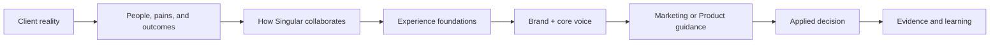

# Start here — The Singular system

**Status:** v0.3 working reference

**Audience:** Anyone working with Singular

**Language:** English (US)

**Owner:** Product Design

**Last reviewed:** July 29, 2026

This is the shortest path through Singular's business, experience, brand, and
writing system. Start with the client—not colors, components, or AI.

## The story

Singular serves established US SMBs, typically generating USD 5M–20M annually.
They already have employees, customers, systems, and operating history. Growth
fragments context, adds manual coordination, and sends decisions back to
founders and key operators. Another AI tool rarely changes that reality.

Singular starts with one consequential workflow and connects the context,
rules, owners, decisions, and evidence it needs. People keep meaningful
control, and the client owns what is created. These needs become experience
foundations, Brand & Voice, and Design System rules that guide each surface,
state, component, and sentence.

## Read what you need

| Need | Read |
|---|---|
| Understand the company, people, problem, and desired outcome | [Client reality](./01-client-context.md) |
| Understand Singular's role and the principles behind the system | [The Singular model](./05-experience-foundations.md) |
| Create or review the shared identity | [Brand & core voice](../brand/README.md) |
| Write website, presentations, social, email, proposals, or case studies | [Marketing manual](../ux-voice/marketing.md) |
| Write product states, actions, approvals, errors, or AI communication | [Product manual](../ux-voice/product.md) |
| Route a task, justify a decision, or check evidence | [Apply & evolve](./08-application-map.md) |

Every shared decision should trace this path. Context moves toward application;
evidence moves back toward the assumptions and foundations it may change.

**Next:** [Client reality](./01-client-context.md)
